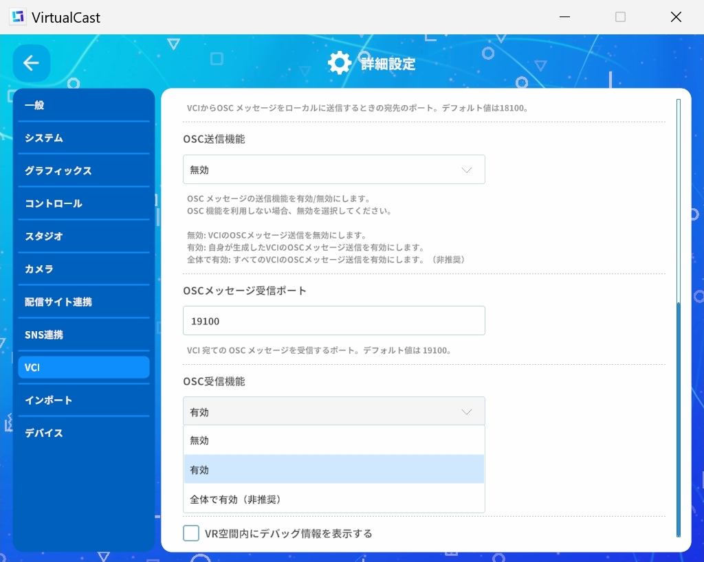
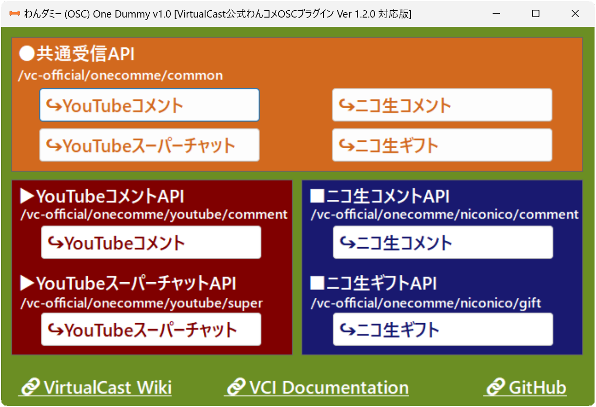
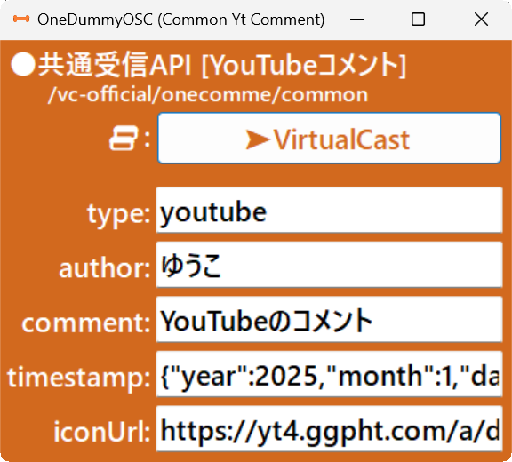
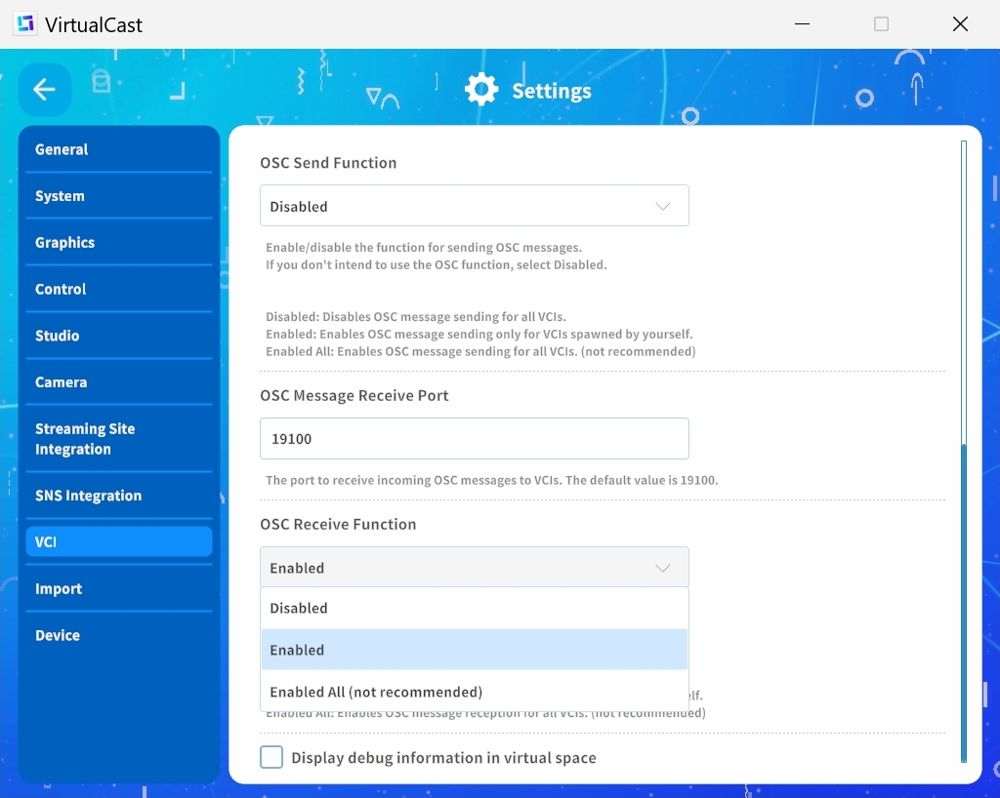

# 「わんダミー」VirtualCast用わんコメOSC疑似送信ツール
「VirtualCast公式わんコメOSCプラグイン Ver 1.2.0」の形式で疑似的なコメント情報が送信できます。  

## 概要
このツールは「VirtualCast公式わんコメOSCプラグイン」と同じ形式でOSCメッセージを送信するデスクトップアプリケーションです。これにより、VCI開発者は実際の配信環境のコメントを模倣し、様々な状況を想定したテストを行うことができます。  
(※「VirtualCast公式わんコメOSCプラグイン」の形式で受信したデータを表示するVCI「わんレシーブ (OSC) One Receive」も別途公開しています。)  

## 動作環境
* Windows(11で動作確認)  
* VirtualCast  

## インストール
1. 「OneDummyOSC.exe」をダウンロードしてください（またはソースコードから自分でコンパイルしてください）。  
2. ウィルス対策ソフト等でファイルをスキャンし、問題がないことを確認してください。  
3. 「OneDummyOSC.exe」を右クリックし、プロパティのセキュリティ項目で「許可する」にチェックを入れてください。  
   - 右クリック→プロパティ→セキュリティ:このファイルは…☑許可する(K)  
4. 「OneDummyOSC.exe」を実行してください(設定ファイル等はありません)。  

## アンインストール
1. 「OneDummyOSC.exe」を削除してください。   

## VirtualCast との連携
VirtualCastのタイトル画面で「VCI」メニュー内の「OSC受信機能」を「有効」または「全体で有効(非推奨)」に設定してください。  


## 使用方法
1. APIを選択してください。  

2. 疑似情報を適宜設定してください。  

3. 「➤VirtualCast」ボタンを押して疑似情報を送信してください。  

## プログラムの挙動
1. ボタンが押されると「VirtualCast公式わんコメOSCプラグイン」形式のデータをOSCで`127.0.0.1:19100`に送信します。  
   ```csharp
   UDPSender("127.0.0.1", 19100);
   OscMessage(oscAddress, blob_jsonString);
   ```

## データ形式
このツールは「VirtualCast公式わんコメOSCプラグイン」が実際に送信するデータ形式に準拠しています。  

1. ●共通受信API  
  `/vc-official/onecomme/common`
   * YouTubeコメント  
     ```json
     {
       "type":"youtube",
       "author":string,
       "comment":string,
       "timestamp":Timestamp(json),
       "iconUrl":string
     }
     ```
     
   * YouTubeスーパーチャット  
     ```json
     {
       "type":"youtube-super",
       "author":string,
       "comment":string,
       "timestamp":Timestamp(json),
       "iconUrl":string,
       "paidText":string,
       "price":int,
       "tier":int,
       "unit":string,
       "colors":Colors(json)
     }
     ```
   * ニコ生コメント  
     ```json
     {
       "type":"niconico",
       "author":string,
       "comment":string,
       "timestamp":Timestamp(json),
       "iconUrl":string
     }
     ```
   * ニコ生ギフト  
     ```json
     {
       "type":"niconico-gift",
       "author":string,
       "comment":string,
       "timestamp":Timestamp(json),
       "iconUrl":string,
       "price":int,
     }
     ```

2. ▶YouTube
   * ▶YouTubeコメントAPI  
     /vc-official/onecomme/youtube/comment  
     ```json
     {
       "id":string,
       "liveId":string,
       "userId":string,
       "name":string,
       "isOwner":bool,
       "isModerator":bool,
       "isMember":bool,
       "autoModerated":bool,
       "timestamp":Timestamp(json),
       "hasGift":bool,
       "comment":string,
       "displayName":string,
       "profileImageUrl":string,
       "type":"youtube",
       "endpoint":"/vc-official/onecomme/youtube/comment"
     }
     ```
   * ▶YouTubeスーパーチャットAPI  
     /vc-official/onecomme/youtube/super  
     ```json
     {
       "id":string,
       "liveId":string,
       "userId":string,
       "name":string,
       "isOwner":bool,
       "isModerator":bool,
       "isMember":bool,
       "autoModerated":bool,
       "timestamp":Timestamp(json),
       "hasGift":bool,
       "comment":string,
       "displayName":string,
       "profileImageUrl":string,
       "type":"youtube-super",
       "endpoint":"/vc-official/onecomme/youtube/super",
       "paidText":string,
       "price":int,
       "unit":string,
       "colors":Colors(json),
       "tier":int
     }
     ```

3. ■ニコ生  
   * ■ニコ生コメントAPI  
     /vc-official/onecomme/niconico/comment  
     ```json
     {
       "id":string,
       "liveId":string,
       "userId":string,
       "name":string,
       "screenName":string,
       "timestamp":Timestamp(json),
       "isOwner":bool,
       "hasGift":bool,
       "no":int,
       "comment":string,
       "premium":bool,
       "anonymity":bool,
       "displayName":string,
       "profileImageUrl":string,
       "type":"niconico",
       "endpoint":"/vc-official/onecomme/niconico/comment"
     }
     ```
   * ■ニコ生ギフトAPI  
     /vc-official/onecomme/niconico/gift  
     ```json
     {
       "id":string,
       "liveId":string,
       "userId":string,
       "name":string,
       "screenName":string,
       "timestamp":Timestamp(json),
       "isOwner":bool,
       "hasGift":bool,
       "comment":string,
       "anonymity":bool,
       "displayName":string,
       "profileImageUrl":string,
       "type":"niconico",
       "endpoint":"/vc-official/onecomme/niconico/comment",
       "price":int
     }
     ```

## VCIの取得
「わんレシーブ (OSC) One Receive」は [VirtualCastで公開中の商品ページ](https://virtualcast.jp/users/100215/products) から取得できます。  

## ライセンス
このプログラムは MIT ライセンスのもとで公開されています。  


# OneDummy: Dummy OneComme OSC Sender for VirtualCast
This tool allows you to send dummy comment information in the format of the "VirtualCast Official OneComme OSC Plugin Ver 1.2.0."  

## Overview
This tool is a desktop application that sends OSC messages in the same format as the "VirtualCast Official OneComme OSC Plugin." VCI developers can use it to simulate comments from a real streaming environment and perform tests under various conditions. 
(*A VCI that displays data received in the format of the "VirtualCast Official OneComme OSC Plugin," called "わんレシーブ (OSC) One Receive," is also available separately.*)

## System Requirements
* Windows (Tested on Windows 11)  
* VirtualCast  

## Installation
1.  Download "OneDummyOSC.exe" (or compile it yourself from the source code).  
2.  Scan the files with antivirus software, etc., and confirm that there are no problems.  
3.  Right-click "OneDummyOSC.exe" and check "Unblock" in the Security section of the properties.  
    *   Right-click → Properties → Security: This file came from… ☑Unblock(K)  
4.  Run "OneDummyOSC.exe" (no configuration files are required).  

## Uninstallation
1.  Delete "OneDummyOSC.exe".  

## Integration with VirtualCast
In the VirtualCast title screen, set the "OSC Receive Function" in the "VCI" menu to "Enabled" or "Enabled All (not recommended)."  


## How to Use
1.  Select an API.   

2.  Set the dummy information as needed.  

3.  Click the "➤VirtualCast" button to send the dummy information.  

## Program Behavior
1. When the button is clicked, data in the "VirtualCast Official OneComme OSC Plugin" format is sent via OSC to `127.0.0.1:19100`.  
   ```csharp
   UDPSender("127.0.0.1", 19100);
   OscMessage(oscAddress, blob_jsonString);
   ```

## Data Format
This tool conforms to the data format actually sent by the "VirtualCast Official OneComme OSC Plugin."    

1. ●Common Receiving API  
  `/vc-official/onecomme/common`
   * YouTube Live Comment  
     ```json
     {
       "type":"youtube",
       "author":string,
       "comment":string,
       "timestamp":Timestamp(json),
       "iconUrl":string
     }
     ```
     
   * YouTube Live Super Chat  
     ```json
     {
       "type":"youtube-super",
       "author":string,
       "comment":string,
       "timestamp":Timestamp(json),
       "iconUrl":string,
       "paidText":string,
       "price":int,
       "tier":int,
       "unit":string,
       "colors":Colors(json)
     }
     ```
   * niconico Live Comment  
     ```json
     {
       "type":"niconico",
       "author":string,
       "comment":string,
       "timestamp":Timestamp(json),
       "iconUrl":string
     }
     ```
   * niconico Live Gift  
     ```json
     {
       "type":"niconico-gift",
       "author":string,
       "comment":string,
       "timestamp":Timestamp(json),
       "iconUrl":string,
       "price":int,
     }
     ```

2. ▶YouTube Live
   * ▶YouTube Live Comment API  
     /vc-official/onecomme/youtube/comment  
     ```json
     {
       "id":string,
       "liveId":string,
       "userId":string,
       "name":string,
       "isOwner":bool,
       "isModerator":bool,
       "isMember":bool,
       "autoModerated":bool,
       "timestamp":Timestamp(json),
       "hasGift":bool,
       "comment":string,
       "displayName":string,
       "profileImageUrl":string,
       "type":"youtube",
       "endpoint":"/vc-official/onecomme/youtube/comment"
     }
     ```
   * ▶YouTube Live Super Chat API  
     /vc-official/onecomme/youtube/super  
     ```json
     {
       "id":string,
       "liveId":string,
       "userId":string,
       "name":string,
       "isOwner":bool,
       "isModerator":bool,
       "isMember":bool,
       "autoModerated":bool,
       "timestamp":Timestamp(json),
       "hasGift":bool,
       "comment":string,
       "displayName":string,
       "profileImageUrl":string,
       "type":"youtube-super",
       "endpoint":"/vc-official/onecomme/youtube/super",
       "paidText":string,
       "price":int,
       "unit":string,
       "colors":Colors(json),
       "tier":int
     }
     ```

3. ■niconico Live  
   * ■niconico Live Comment API  
     /vc-official/onecomme/niconico/comment  
     ```json
     {
       "id":string,
       "liveId":string,
       "userId":string,
       "name":string,
       "screenName":string,
       "timestamp":Timestamp(json),
       "isOwner":bool,
       "hasGift":bool,
       "no":int,
       "comment":string,
       "premium":bool,
       "anonymity":bool,
       "displayName":string,
       "profileImageUrl":string,
       "type":"niconico",
       "endpoint":"/vc-official/onecomme/niconico/comment"
     }
     ```
   * ■niconico Live Gift API  
     /vc-official/onecomme/niconico/gift  
     ```json
     {
       "id":string,
       "liveId":string,
       "userId":string,
       "name":string,
       "screenName":string,
       "timestamp":Timestamp(json),
       "isOwner":bool,
       "hasGift":bool,
       "comment":string,
       "anonymity":bool,
       "displayName":string,
       "profileImageUrl":string,
       "type":"niconico",
       "endpoint":"/vc-official/onecomme/niconico/comment",
       "price":int
     }
     ```

## Obtaining the VCI
"わんレシーブ (OSC) One Receive" can be obtained from the [My product page on VirtualCast](https://virtualcast.jp/users/100215/products).  

## License
This program is released under the MIT License.  
